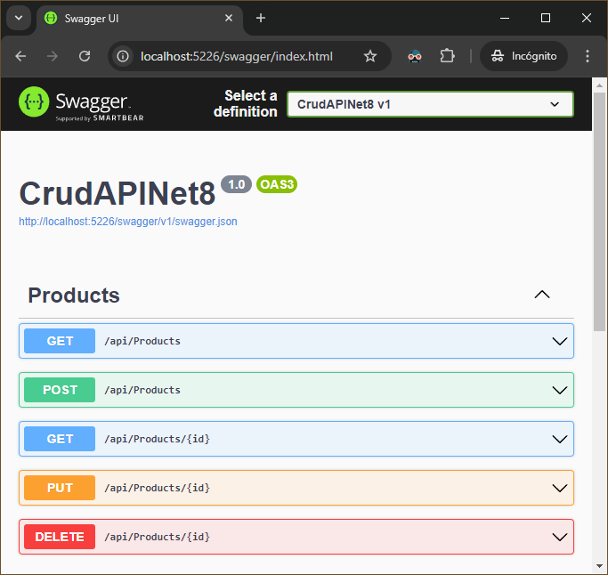
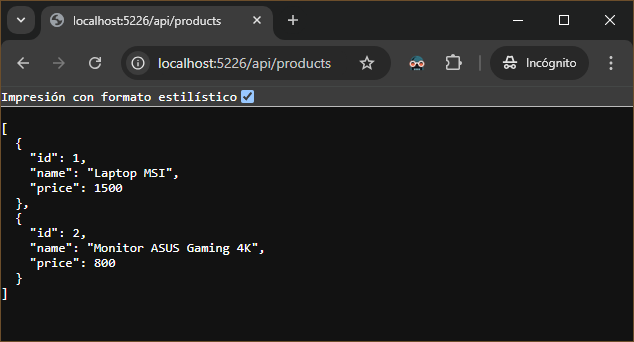

# Web API CRUD - Net 8
- https://github.com/Jonatandb/CrudAPINet8

### Quickstart:

 Set connection string in `appsettings.Development.json`:
 - Add this:
```csharp
  "ConnectionStrings": {
    "ProductDbContext": "Host=localhost;Database=store;Username=store_owner;Password=[pass];SslMode=Require;Trust Server Certificate=true;"
  }
```
 OR set Github Codespaces secret:
- Go to https://github.com/settings/codespaces
- Add a secret named "CRUDAPINET8_NEONCONNECTIONSTRING" with a valid connection string to a PostgreSQL database in the format:
   - "Host=localhost;Database=store;Username=store_owner;Password=[pass];SslMode=Require;Trust Server Certificate=true;"


### Run

```bash
dotnet restore
dotnet ef database update (*required only the first time)
dotnet run
```
Visit:
- http://localhost:5226/swagger 🎉
- http://localhost:5226/api/products





---

### Neon Database Project (Free PostgreSQL Database)
- https://console.neon.tech/app/projects/yellow-fog-04617934/branches/br-silent-hill-a8a5qfpq/tables?database=store

---

## Performed steps:
Project creation
```bash
dotnet new webapi -n CrudAPINet8 -controllers
```

Product model added:
- Models/Product.cs

Package installation:
```bash
dotnet tool install --global dotnet-ef
```
  - Tool to work with EFCore through the command line.

Package installation:
```bash
dotnet add package Microsoft.EntityFrameworkCore
```
  - ORM that allows to .NET work with several databases.

Package installation:
```bash
dotnet add package Microsoft.EntityFrameworkCore.Tools
```
  - Allows to manage migrations through DbContext.

Package installation:
```bash
dotnet add package Npgsql.EntityFrameworkCore.PostgreSQL
```
  - PostgreSQL/Npgsql provider for EntityFrameworkCore.

DbContext file added:
- Data/ProductDbContext.cs

Database creation (PostgreSQL):
- Database name: store

Setting of conection string (choose one method/alternative):
  - Set connection string in `appsettings.Development.json`:

    ```csharp
    "ConnectionStrings": {
        "ProductDbContext": "Host=localhost;Database=store;Username=store_owner;Password=[pass];SslMode=Require;Trust Server Certificate=true;"
    }
    ```
 - OR set Github Codespaces secret (environment variable):
    - Go to https://github.com/settings/codespaces
    - Add a secret named "CRUDAPINET8_NEONCONNECTIONSTRING" with a valid connection string to a PostgreSQL database in the format:
      - "Host=localhost;Database=store;Username=store_owner;Password=[pass];SslMode=Require;Trust Server Certificate=true;"

Update of DbContext service configuration in `program.cs` to allow it to read connection string:
```csharp
var connectionString = Environment.GetEnvironmentVariable("CRUDAPINET8_NEONCONNECTIONSTRING")
                        ?? builder.Configuration.GetConnectionString("ProductDbContext");

builder.Services.AddDbContext<ProductDbContext>(options => options.UseNpgsql(connectionString ?? throw new InvalidOperationException("Connection string 'ProductDbContext' not found.")));
```

Package installation:
```bash
dotnet tool install --global dotnet-aspnet-codegenerator
```
  - Code Generator of Controllers and Views for NetCore.

Package installation:
```bash
dotnet add package Microsoft.EntityFrameworkCore.SqlServer
```
  - Package required by dotnet-aspnet-codegenerator.

Package installation:
```bash
dotnet add package Microsoft.VisualStudio.Web.CodeGeneration.Design
```
  - Code Generator of Controllers and Views at project level.


Product controller generation:
```bash
dotnet-aspnet-codegenerator controller -name ProductController -api -outDir Controllers --model Product --dataContext ProductDbContext -async -actions
```
 - This command generates a controller named ProductController in the Controllers directory using the Product model and ProductDbContext data context. The controller is created with async methods and CRUD (Create, Read, Update, Delete) actions for the API.
   - https://learn.microsoft.com/en-us/aspnet/core/fundamentals/tools/dotnet-aspnet-codegenerator?view=aspnetcore-8.0

Package uninstall:
```bash
dotnet remove package Microsoft.EntityFrameworkCore.SqlServer
```
  - No longer needed package.

Migration generation:
```bash
dotnet ef migrations add InitialMigration
```

Database update (tables creation):
```bash
dotnet ef database update
```

Running the project:
```bash
dotnet run
```
